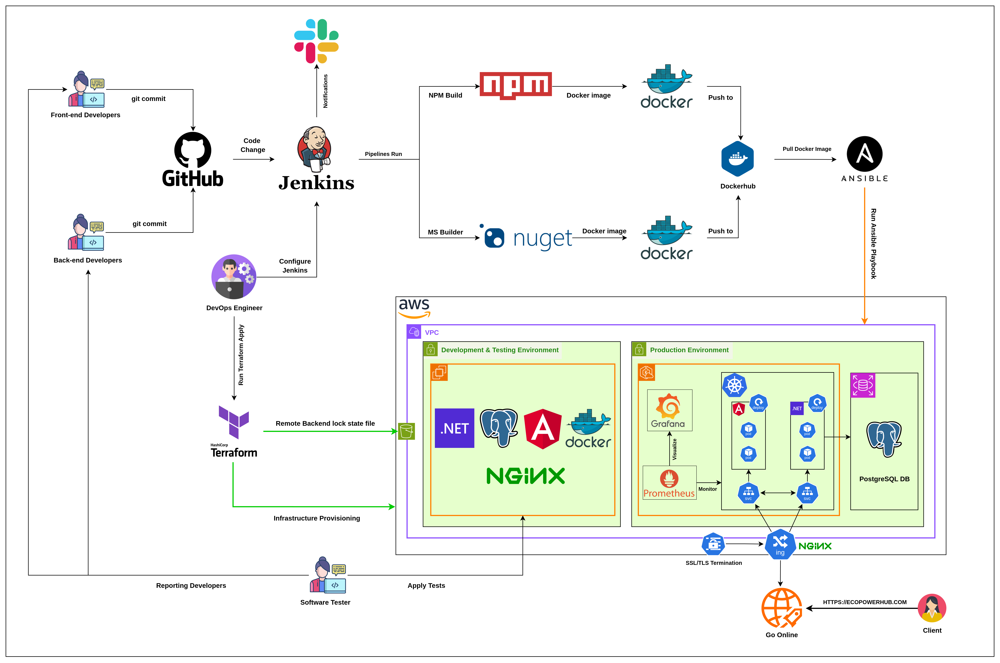

# EcoPowerHub DevOps Infrastructure

A complete DevOps infrastructure setup for the EcoPowerHub application, implementing CI/CD pipelines, container orchestration, monitoring, and infrastructure as code.

## Project Overview



This project implements a modern DevOps infrastructure for EcoPowerHub, including:

- CI/CD pipelines with Jenkins
- Container orchestration with Kubernetes
- Infrastructure as Code with Terraform
- Configuration management with Ansible
- Monitoring with Prometheus and Grafana
- Load balancing with Nginx

## Infrastructure Components

### AWS Infrastructure (Terraform)

- VPC with public and private subnets
- EKS cluster for container orchestration
- S3 buckets for artifacts and cache
- IAM roles and policies
- Monitoring instance setup

### Kubernetes Resources

- Frontend deployment and service
- Backend API deployment and service
- Ingress controller with SSL/TLS
- Prometheus monitoring setup

### CI/CD Pipeline

#### Frontend Pipeline
- Source control integration
- Node.js build process
- Docker image creation
- Automated deployment
- Slack notifications

#### Backend Pipeline
- .NET build and test
- Docker containerization
- SonarQube analysis
- Automated deployment
- Monitoring integration

### Monitoring Stack

- Prometheus server
- Grafana dashboards
- Custom scrape configurations
- Application metrics collection

## Directory Structure

```
.
├── Ansible/               # Ansible playbooks and inventory
├── Docker/                # Dockerfile and compose files
├── Jenkins/               # Jenkins pipeline definitions
├── Kubernetes/            # K8s manifests
├── Nginx/                 # Nginx configuration
├── Prometheus/            # Monitoring configuration
└── Terraform/             # Infrastructure as Code
```

## Prerequisites

- AWS Account
- Terraform installed
- kubectl configured
- Docker installed
- Jenkins server
- Ansible control node

## Getting Started

1. **Initialize Terraform:**
```sh
cd Terraform
terraform init
```

2. **Deploy Infrastructure:**
```sh
terraform plan
terraform apply
```

3. **Configure Kubernetes:**
```sh
kubectl apply -f Kubernetes/
```

4. **Deploy Monitoring:**
```sh
cd Prometheus
docker-compose up -d
```

5. **Set up CI/CD:**
   - Configure Jenkins pipelines using provided Jenkinsfiles
   - Set up webhook triggers
   - Configure Slack notifications

## Environment Configuration

The infrastructure supports multiple environments:
- Development
- Testing
- Production

Each environment is configured through Terraform variables and Kubernetes namespaces.

## Security

- SSL/TLS encryption
- Private subnets for sensitive components
- IAM role-based access
- Network security groups
- Container security policies

## Monitoring and Logging

- Application metrics
- Infrastructure monitoring
- Custom Prometheus exporters
- Grafana dashboards
- Container logs aggregation

## Contributing

1. Fork the repository
2. Create a feature branch
3. Commit your changes
4. Push to the branch
5. Create a Pull Request

## Contact

khhaledd.77@gmail.com